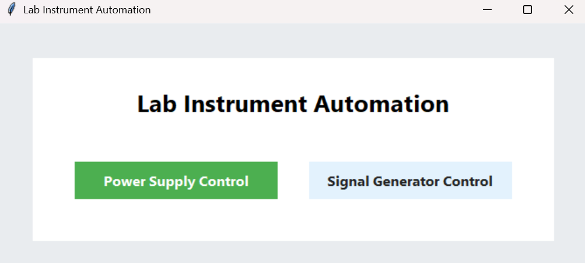
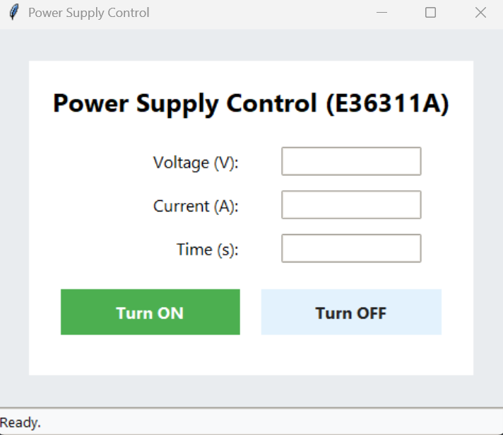

# Lab Instrument Automation

A modern Python desktop application for automating laboratory instruments, featuring a user-friendly GUI built with Tkinter. Supports Keysight 33500B signal generator and E36311A power supply, with robust SCPI command integration and advanced usability features.

## Features

- **Graphical User Interface (GUI):**
    - Tkinter-based, clean and modern design
    - Main menu for switching between instrument panels
    - All instrument controls via GUI (no console input required)

- **Power Supply Control (E36311A):**
    - Set voltage, current, and duration
    - Live countdown and status bar
    - Start/stop buttons always visible
    - Model number displayed in window title

- **Signal Generator Control (33500B):**
    - Dual-channel output with independent settings
    - Input Type: Sin, Square, DC
    - For DC: only offset is used as output voltage; Peak-to-Peak Voltage and phase mode are disabled
    - For Sin/Square: set frequency, peak-to-peak voltage, offset, and phase mode
    - Phase Mode: In-phase or Antiphase
    - Clock generator (second instrument) with enable/disable option
    - All controls always visible
    - Model number displayed in window title

- **Instrument Communication:**
    - Uses PyVISA for USB communication
    - Robust SCPI command handling
    - Correct High-Z output configuration

- **Threaded Operation:**
    - Parallel control of signal and clock generators
    - Responsive GUI during instrument operation

## Screenshots





## Quick Start

1. **Install Requirements:**
     ```powershell
     pip install -r requirements.txt
     ```

2. **Connect Instruments:**
     - Plug in Keysight 33500B and E36311A via USB
     - Confirm VISA addresses in `instruments.py` match your devices

3. **Run the Application:**
     ```powershell
     python src/main.py
     ```

4. **Use the GUI:**
     - Select instrument panel from the main menu
     - Enter desired parameters and start/stop outputs

## File Structure

```
lab-instrument-automation/
├── README.md
├── requirements.txt
├── online_code.py
├── src/
│   ├── main.py
│   ├── GeneratorsSync_testing.py
│   ├── PowerSupply_testing.py
│   └── classes/
│       ├── __init__.py
│       ├── instruments.py
│       ├── measurements.py
│       ├── Trial_classes.py
│       └── Measurements_howto
```

## Instrument Support

- **Keysight 33500B Signal Generator**
    - Dual-channel, phase control, waveform selection
- **Keysight E36311A Power Supply**
    - Voltage/current/time control, live status

## Advanced Usability

- All controls are always visible and never recreated dynamically
- Input fields are enabled/disabled contextually (e.g., DC disables peak-to-peak voltage)
- Robust error handling and status feedback
- Modern, visually separated input sections

## Requirements

- Python 3.8+
- PyVISA
- Tkinter (standard with Python)

## NOTE

Support for the Audio Precission APx555 audio analyzer is being developed and not fully functional as of yet.

## License

MIT License

---

For questions or contributions, please contact the repository owner or open an issue.