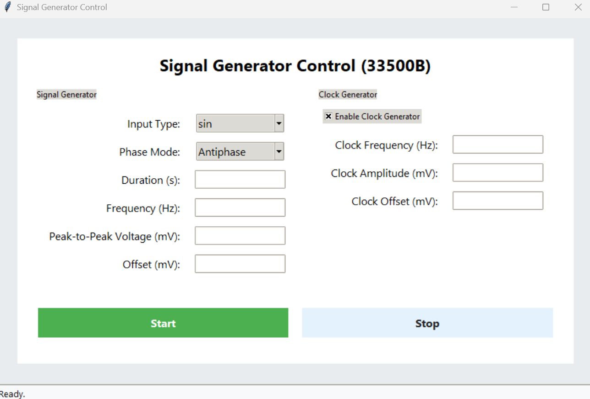

# Lab Instrument Automation

A comprehensive Python desktop application for automating laboratory instruments, featuring a modern GUI built with Tkinter. Designed for the Neuranics ASIC Lab, supporting multiple Keysight instruments and Audio Precision APx500 series analyzers with both manual control and automated testing capabilities.

## Features

### **Main Application Structure:**
- **Dual-Mode Interface:** Choose between Manual Testing and Automated Tests
- Modern, responsive Tkinter-based GUI with custom styling
- Neuranics ASIC Lab branding and professional appearance
- Error handling and instrument connectivity validation

### **Manual Testing Mode:**
Individual instrument control panels with full functionality:

- **SMU (Source Measure Unit) Control:**
    - Voltage, current, and duration settings
    - Live countdown timer and status feedback
    - Safe turn-on/turn-off operations

- **Signal Generator Control (33500B):**
    - Dual-channel output with independent configuration
    - Waveform types: Sine, Square, DC
    - Frequency, amplitude, offset, and phase control
    - Clock generator support with enable/disable
    - Phase modes: In-phase or Antiphase (180° phase shift)
    - Duration-based operation with countdown

- **Oscilloscope Control:**
    - Waveform data acquisition and export
    - CSV data saving capabilities
    - Channel configuration and measurement setup

- **Audio Precision Control:**
    - Direct integration with APx500 software
    - Launch APx500 application from GUI
    - Note: Manual control redirects to native APx500 interface

### **Automated Testing Mode:**
Pre-configured test sequences for common measurements:

- **Noise vs Frequency Test:**
    - Automated noise density measurements
    - SMU power supply control integration
    - Signal generator configuration
    - Audio Precision APx500 integration for precise measurements

- **Transfer Function Analysis:**
    - Input/output signal comparison
    - Frequency response characterization
    - Magnitude and phase analysis
    - FFT-based and Welch method processing
    - Automated plotting and data export

### **Advanced Analysis Capabilities:**
- **Transfer Function Analyzer Class:**
    - Audio file loading and signal processing
    - Multiple computation methods (FFT, Welch)
    - Magnitude and phase response plotting
    - Signal comparison visualization
    - Apply transfer functions to test signals

### **Instrument Communication:**
- PyVISA-based USB communication
- Robust SCPI command implementation
- High-impedance output configuration
- Multi-threaded operation for responsive GUI
- Automatic instrument detection and error handling

## Screenshots





## Quick Start

1. **Install Requirements:**
     ```powershell
     pip install -r requirements.txt
     ```

2. **Install Dependencies:**
     - **VISA Backend:** Install NI-VISA or Keysight IO Libraries Suite
     - **Audio Precision:** Ensure APx500 software (v9.1+) is installed
     - **.NET Framework:** Required for Audio Precision integration
     - **Optional:** .NET 6.0 SDK for generating type stubs

3. **Connect Instruments:**
     - Plug in instruments via USB
     - Verify VISA addresses in `src/classes/instruments.py` match your devices
     - Use Keysight Connection Expert to confirm instrument connectivity

4. **Run the Application:**
     ```powershell
     python src/main.py
     ```

5. **Use the Interface:**
     - Choose **Manual Testing** for individual instrument control
     - Choose **Automated Tests** for pre-configured measurement sequences
     - Follow on-screen prompts and status indicators

## File Structure

```
lab-instrument-automation/
├── README.md
├── requirements.txt
├── src/
│   ├── main.py                    # Application entry point
│   └── classes/
│       ├── __init__.py
│       ├── instruments.py         # Instrument control classes
│       ├── GUIs.py               # All GUI classes and layouts
│       ├── measurements.py       # Measurement algorithms and analysis
│       └── measurements_AP.py    # Audio Precision specific measurements
├── APx500_Python/               # Audio Precision examples and documentation
│   ├── APx500 Python Guide.pdf
│   ├── APx500PythonExample_ConsoleApp.py
│   ├── APx500PythonExample_WithGraphicalInterface.py
│   └── FreqSweep.py
├── Guides/                      # Documentation and command references
│   ├── 33511B_SCPI_COMMANDS.txt
│   └── Measurements_howto
├── Pictures/                    # GUI screenshots
│   ├── Home_Page.png
│   ├── PowerSupply_Page.png
│   └── SignalGen_Page.png
├── Testing files/               # Development and testing scripts
│   ├── SignalGentests.py
│   ├── SMU.py
│   ├── Trial_classes.py
│   └── oscilloscope testing/
└── typings/                     # Type stubs for .NET integration
    ├── AudioPrecision/
    ├── System/
    └── Microsoft/
```

## Supported Instruments

### **Keysight Test Equipment:**
- **33500B Signal Generator** (Dual-channel)
    - Waveform generation: Sine, Square, DC
    - Frequency range: DC to 30 MHz
    - Phase control and synchronization
    - High-impedance output configuration

- **SMU (Source Measure Unit)**
    - Precision voltage/current sourcing
    - Real-time measurement capabilities
    - Configurable compliance settings

- **Oscilloscope** (Model varies)
    - Multi-channel data acquisition
    - Waveform capture and analysis
    - CSV data export functionality

### **Audio Precision:**
- **APx500 Series Audio Analyzers**
    - Integration with APx500 v9.1+ software
    - Automated noise measurements
    - Transfer function analysis
    - Signal analyzer capabilities
    - .NET API integration via pythonnet

## Technical Implementation

### **GUI Architecture:**
- **Main Application:** Neuranics ASIC Lab branded interface
- **Manual Testing Mode:** Individual instrument control panels
- **Automated Testing Mode:** Pre-configured measurement sequences
- **Custom Styling:** Professional appearance with rounded buttons and modern typography

### **Communication Protocols:**
- **VISA Communication:** PyVISA for SCPI instrument control
- **.NET Integration:** pythonnet for Audio Precision API access
- **Multi-threading:** Responsive GUI during long operations
- **Error Handling:** Comprehensive instrument connectivity validation

### **Data Processing:**
- **Signal Analysis:** NumPy and SciPy for mathematical operations
- **Transfer Functions:** FFT and Welch method implementations
- **Visualization:** Matplotlib for plotting and data presentation
- **File I/O:** CSV export for measurement data

## Requirements

### **Software Dependencies:**
- Python 3.8+
- PyVISA (instrument communication)
- pythonnet (.NET integration)
- NumPy (numerical operations)
- SciPy (signal processing)
- Matplotlib (data visualization)
- Pillow (image processing)
- Tkinter (GUI framework - included with Python)

### **System Requirements:**
- **VISA Backend:** NI-VISA or Keysight IO Libraries Suite
- **Audio Precision:** APx500 software v9.1 or higher
- **.NET Framework:** Required for Audio Precision integration
- **Optional:** .NET 6.0 SDK for type stub generation

### **Hardware:**
- USB connections for all Keysight instruments
- Audio Precision APx500 series analyzer (for audio measurements)
- Windows operating system (recommended for Audio Precision support)

## Development Status

### **Fully Functional:**
- ✅ Main application GUI and navigation
- ✅ Manual instrument control (SMU, Signal Generator, Oscilloscope)
- ✅ Signal generator dual-channel operation
- ✅ Transfer function analysis algorithms
- ✅ Audio Precision software integration

### **In Development:**
- 🔄 Transfer Function GUI implementation
- 🔄 Automated test sequence optimization
- 🔄 Enhanced error handling and logging

### **Future Enhancements:**
- 📋 Additional automated test protocols
- 📋 Data logging and report generation
- 📋 Remote instrument control capabilities

## Troubleshooting

### **Common Issues:**

**Instrument Not Found:**
- Verify USB connections and instrument power
- Check VISA addresses in `src/classes/instruments.py`
- Use NI-MAX to detect instruments
- Ensure proper VISA drivers are installed

**Audio Precision Errors:**
- Confirm APx500 software is installed and licensed
- Verify .NET Framework installation
- Check that pythonnet can access AudioPrecision.API assemblies

**GUI Issues:**
- Ensure all required Python packages are installed
- Check Python version compatibility (3.8+)
- Verify Tkinter is available (standard with most Python installations)

## Usage Examples

### **Manual Testing:**
1. Launch application: `python src/main.py`
2. Select "Manual Testing" from main menu
3. Choose desired instrument (SMU, Signal Generator, etc.)
4. Configure parameters in the instrument's control panel
5. Use ON/OFF buttons to control output

### **Automated Testing:**
1. Select "Automated Tests" from main menu
2. Choose test type (Noise vs Frequency, Transfer Function)
3. Configure test parameters
4. Click "Start" to begin automated sequence
5. Monitor progress and review results

## License

MIT License

## Contributing

This project is developed for the Neuranics ASIC Lab. For questions, issues, or contributions:
- Contact the repository owner
- Open an issue on the project repository
- Follow established coding standards and documentation practices

---

**Neuranics ASIC Lab Automation System**
*Professional laboratory instrument control and automated testing solution*